# Part 1. Установка ОС

**Установить Ubuntu 20.04 Server LTS без графического интерфейса. (Используем программу для виртуализации - VirtualBox)**  

- Устанавка образа ОС в VirtualBox:

  

- Проверка номера версии:

  

# Part 2. Создание пользователя

**Создать пользователя, отличного от пользователя, который создавался при установке. Пользователь должен быть добавлен в группу adm**  

- Создание нового пользователя user_two и добавление его в группу adm:

  

- Вывод команды \ cat /etc/passwd:

  

# Part 3. Настройка сети ОС 

**1. Задать название машины вида user-1**  
**2. Установить временную зону, соответствующую вашему текущему местоположению**  
**3. Вывести названия сетевых интерфейсов с помощью консольной команды**  

- Определение названия машины вида user-1

  

- Установка временной зоны, соответствующей нашему текущему местоположению (выбор производится из списка по команде **timedatectl list-timezones**) и отображение изменений на выводе консоли:

  

- Установка набора сетевых инструментов:

  

- Вывод названия сетевых интерфейсов:

  

***Информация:***  
***Интерфейс lo (Loopback Interface)** представляет собой виртуальный сетевой интерфейс в операционных системах, таких как Linux и UNIX-подобные системы. Он используется для локальной коммуникации на самом устройстве и обычно имеет IP-адрес 127.0.0.1, который также обозначается как "localhost".*  

- Получение ip адреса устройства, на котором производится работа, от DHCP сервера.

  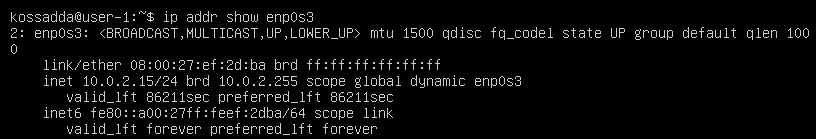

***Информация:***  
***DHCP (Dynamic Host Configuration Protocol)** - это сетевой протокол, используемый для автоматической настройки сетевых параметров устройствам в компьютерной сети. Протокол DHCP позволяет устройствам автоматически получать IP-адреса, а также другие сетевые параметры, такие как шлюз по умолчанию (gateway), маску подсети (subnet mask), адреса DNS-серверов и многое другое.*  

- Вывод на экран внешнего ip-адрес шлюза:  

  

- Вывод на экран внутреннего IP-адрес шлюза, он же ip-адрес по умолчанию (gw):  

  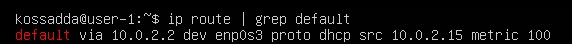

- Установка статичных настроек ip, gw, dns (с использованием публичных DNS серверов, например 1.1.1.1 или 8.8.8.8):  

  

- Сохранение изменений. Перезагрузка виртуальной машины:

  

- Проверка изменений статичных сетевых настроек (ip, gw, dns) на соответстветствие заданным в предыдущем пункте:

  

- Пингование удаленных хостов 1.1.1.1 и ya.ru. Убедить в наличии на выводе команды фразы “0% packet loss”:

  

# Part 4. Обновление ОС 

**Обновить системные пакеты до последней на момент выполнения задания версии**

- После успешного обновления повторно применяем команду и проверяем установлена ли последняя версия:

  

# Part 5. Использование команды sudo 

**Разрешить пользователю, созданному в Part 2, выполнять команду sudo**

***Информация:***  
*Команда **sudo (Superuser Do)** в системах **Unix** и **Linux** используется для выполнения команд с правами суперпользователя (root) или другого пользователя, имеющего необходимые разрешения на выполнение определенной команды. Команда sudo позволяет пользователям выполнять административные задачи и другие привилегированные операции, обычно требующие повышенных привилегий, без необходимости входа в систему под учетной записью суперпользователя (root).*  

- Добавление нового пользователя в группу обладающих привелегией **sudo**. Переключение на данного пользователя. Изменение hostname ОС от имени пользователя, созданного в пункте Part 2 (используя sudo):

  

# Part 6. Установка и настройка службы времени

**Настроить службу автоматической синхронизации времени**

- Вывод времени, часового пояса, в соответствии с нашим местоположением:

  

# Part 7. Установка и использование текстовых редакторов

**Установить текстовые редакторы VIM (+ любые два по желанию NANO, MCEDIT, JOE и т.д.)**

  

### Открытие редактора vim и ввод ника:

  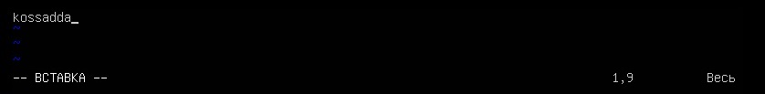

***Для сохранения в новый файл test_vim.txt:***  
1. Нажимается ESC.  
2. Нажимается ":".  
3. В появившейся командной строке программы прописывается "wq test_vim.txt" (для сохранения текста в файл с указанным названием и последующего выхода из программы).  

  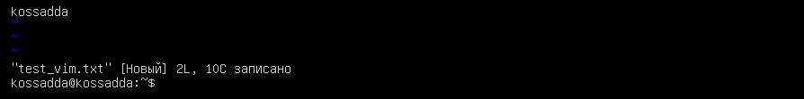

- Проверка файла на сохранение введенного текста:

  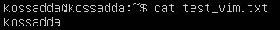

### Открытие редактора nano и ввод ника:

  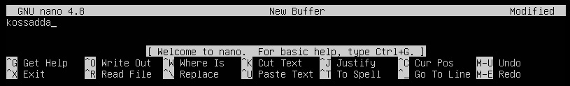

- Нажатие Ctrl+X приводит к появлению следующего сообщения:

  

- При подтверждении сохранения (нажатие на Y) выходит поле для имени будущего файла. Прописывается ***test_nano.txt***:

  

- Проверка файла на сохранение введенного текста:

  

### Открытие редактора joe и ввод ника:

  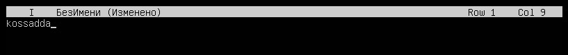

- Нажатие Ctrl+K и W приводит к появлению поля для имени будущего файла. Прописывается ***test_joe.txt***:

  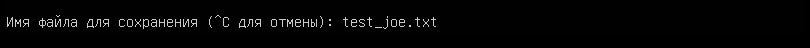

**Нажатие Ctrl+C после сохраненных изменений приводит к выходу из программы.**

- Проверка файла на сохранение введенного текста:

  

### Открытие test_vim.txt через vim и замена текста:

  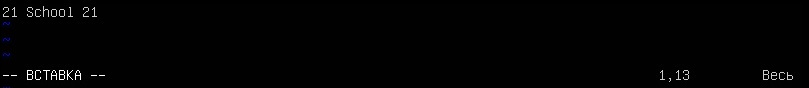

***Для выхода из vim без сохранения изменений:***  
1. Нажимается ESC.  
2. Нажимается ":".  
3. В появившейся командной строке программы прописывается "q!".  

  

- Проверка файла на отсутствие изменений в тексте:

  

### Открытие test_nano.txt через nano и замена текста:

  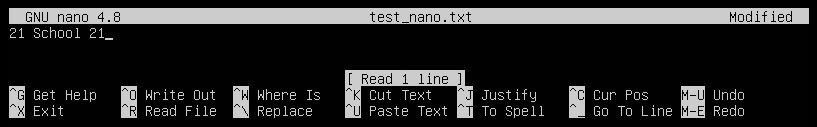

- Нажатие Ctrl+X приводит к появлению следующего сообщения (нажимается N для подтверждения выхода без сохранения изменений):

  

- Проверка файла на отсутствие изменений в тексте:

  

### Открытие test_joe.txt через joe и замена текста:

  

- Нажатие Ctrl+C приводит к появлению следующего сообщения (нажимается y для подтверждения выхода без сохранения изменений):

  

- Проверка файла на отсутствие изменений в тексте:

  

***Для поиска текста в vim необходимо:***  
1. Нажать на "/".  
2. Ввести шаблон поиска.  
3. Нажать Enter, чтобы выполнить поиск.  
4. Нажатие на "n" чтобы найти следующее вхождение, или "N" чтобы найти предыдущее вхождение.  

  

***Для поиска текста в nano необходимо:***  
1. Нажать на Ctrl+W.  
2. Ввести шаблон поиска.  
3. Нажать Enter, чтобы выполнить поиск.  
4. Для повторения поиска далее по тексту повторно нажимается Ctrl+W и Enter, для хождения в обратную сторону Ctrl+Q.  

  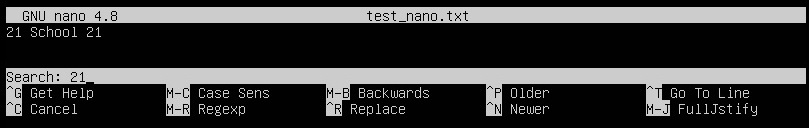

***Для поиска текста в joe необходимо:***  
1. Нажать Ctrl+K и F.  
2. Ввести шаблон поиска и Enter.  
3. Нажать Enter, чтобы выполнить поиск далее по тексту.  
4. Для повторения поиска выполняются те же действия. Для поиска в обратную сторону необходимо после первого нажатия на Enter прописать b.  

  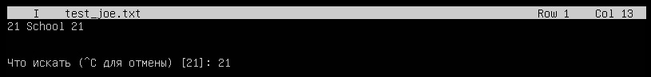

  

***Для замены текста в vim необходимо:***  
1. Нажать на ":".  
2. Прописать "%s" для поиска по всему тексту.  
3. Через "/" ввести шаблон поиска.  
4. Снова через "/" прописать шаблон замены и нажать Enter.  
5. Для повторения команды выполнить все шаги заново.  

  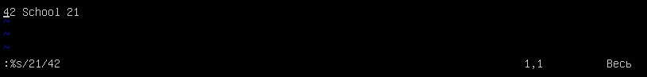

***Для замены текста в nano необходимо:***  
1. Нажать на "Ctrl+\".  
2. Ввести шаблон поиска и нажать Enter.  
3. Ввести шаблон замены и нажать Enter.  
4. Подтвердить замену текста нажатием на "Y". Для продолжения замены повторно нажать на "Y".  

  

  

  

***Для замены текста в joe необходимо:***  
1. Нажать Ctrl+K и F.  
2. Ввести шаблон поиска и Enter.  
3. Прописать r в появившейся командной строке и нажать Enter.  
4. Ввести шаблон замены и нажать Enter.  
5. Подтвердить замену текста нажатием на "Y". Для продолжения замены повторно нажать на "Y".  

  

  

  

  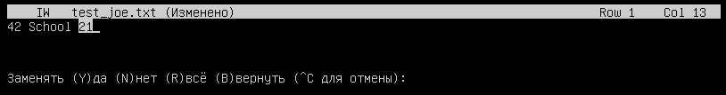

# Part 8. Установка и базовая настройка сервиса SSHD 

**1. Установить службу SSHd.**  
**2. Добавить автостарт службы при загрузке системы.**  
**3. Перенастроить службу SSHd на порт 2022.**  
**4. Используя команду ps, показать наличие процесса sshd. Для этого к команде нужно подобрать ключи.**  

- Установка службы SSHd:

  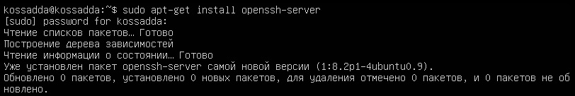

- Настройка автозапуска службы:

  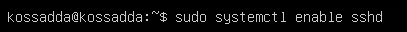

- Изменение конфига:

  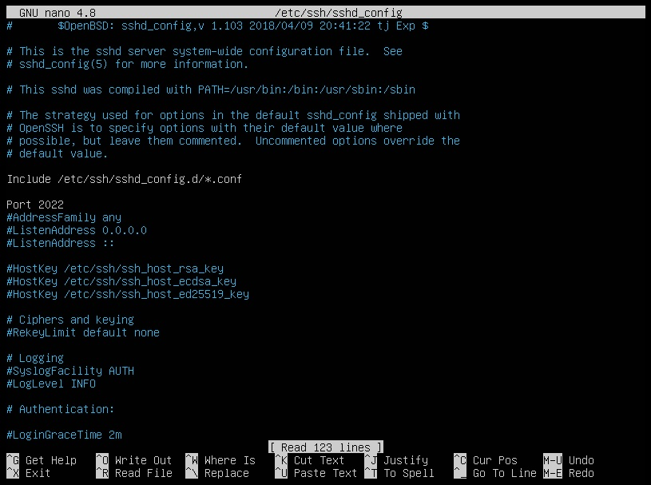

- Проверка на запущенный процесс:

  

***Информация:***  
*"ps" - выводит сведения о процессах в статическом виде*  
*"-e" - позволяет выбрать все процессы*  
*"| grep sshd" - вывод всех строк содержащих sshd*  

- Перезагрузка системы через reboot.  

- Вывод команды netstat -tan:

  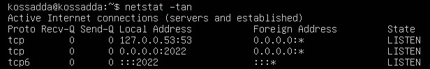

***Информация:***  
*-t (флаг TCP): Этот флаг указывает netstat отображать только информацию о TCP-соединениях. TCP (Transmission Control Protocol) - это протокол управления передачей данных, который обеспечивает надежное и упорядоченное соединение между устройствами.*  
*-a (флаг All): Этот флаг указывает netstat отображать все сетевые соединения, включая прослушивающие порты и активные соединения. Если этот флаг не указан, netstat будет выводить только активные соединения.*  
*-n (флаг Numeric): Этот флаг указывает netstat не выполнять разрешение DNS-имен в IP-адреса. Вместо этого он отображает IP-адреса в числовом виде, что может ускорить выполнение команды и предотвратить задержки, связанные с DNS-запросами.*  

***Расшифровка столбцов вывода:***  
*1. Proto (Протокол): Этот столбец показывает используемый сетевой протокол для каждого соединения. Протокол может быть TCP (Transmission Control Protocol) или UDP (User Datagram Protocol). TCP используется для установления надежных соединений, а UDP - для более быстрой, но менее надежной передачи данных.*  
*2. Recv-Q (Очередь приема): Этот столбец показывает количество байт данных, ожидающих приема на сокете.*  
*3. Send-Q (Очередь отправки): Этот столбец показывает количество байт данных, ожидающих отправки на сокете.*  
*4. Local Address (Локальный адрес): Этот столбец указывает IP-адрес и порт вашего компьютера, на котором работает процесс или служба. IP-адрес обычно представлен в формате IPv4 (например, 192.168.1.1) или IPv6 (например, fe80::1).*  
*5. Foreign Address (Удаленный адрес): Этот столбец указывает IP-адрес и порт удаленного компьютера или сервера, с которым установлено сетевое соединение.*  
*6. State (Состояние): Этот столбец показывает текущее состояние сетевого соединения. Например, "ESTABLISHED" означает, что соединение установлено и активно, "LISTEN" означает, что порт прослушивается на входящие соединения, "TIME_WAIT" означает, что соединение было закрыто, но ожидает завершения последних пакетов данных.*  

# Part 9. Установка и использование утилит top, htop   

1. uptime - 46 min  
2. Количество авторизованных пользователей - 1 user  
3. Общая загрузка системы - 0.00, 0.01, 0.00  
4. Общее количество процессов - 113 total  
5. Загрузка cpu - 0.0 us, 0.0 sy, 0.0 ni, 100.0 id, 0.0 wa, 0.0 hi, 0.0 si, 0.0 st  
6. Загрузка памяти - 2412.2 total, 1867.1 free, 157.3 used, 387.7 buff/cache  
7. pid процесса, занимающего больше всего памяти - 708  
8. pid процесса, занимающего больше всего процессорного времени - 708  

***Вывод команды htop отсортированной по PID:***  

  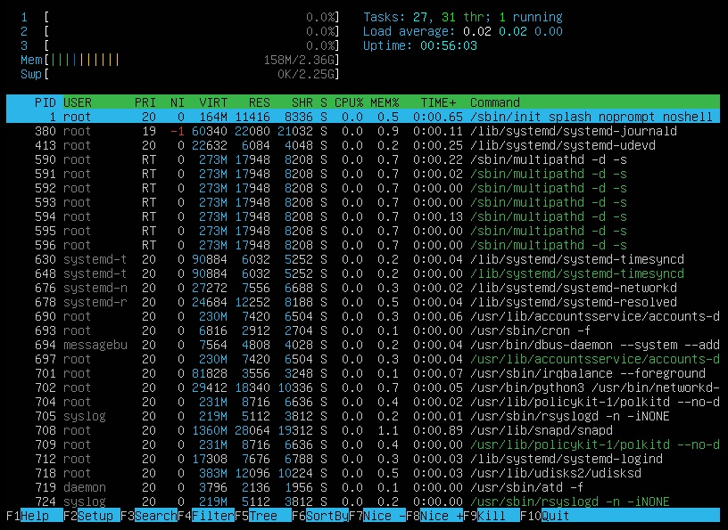

***Вывод команды htop отсортированной по PERCENT_CPU:***  

  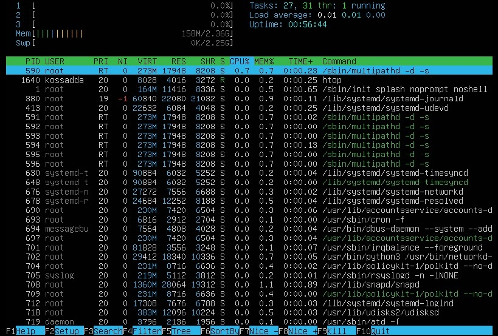

***Вывод команды htop отсортированной по PERCENT_MEM:***  

  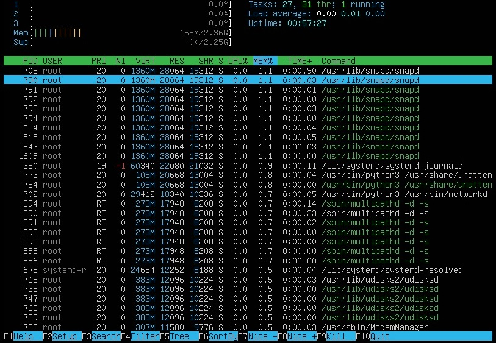

***Вывод команды htop отсортированной по TIME:***  

  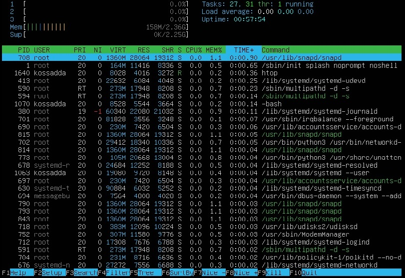

***Вывод команды htop отфильтрованной для процесса sshd:***  

  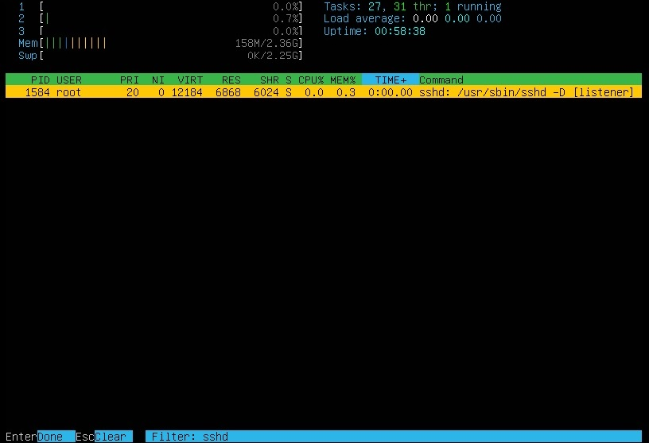

***Вывод команды htop с процессом syslog, найденным, используя поиск:***  

  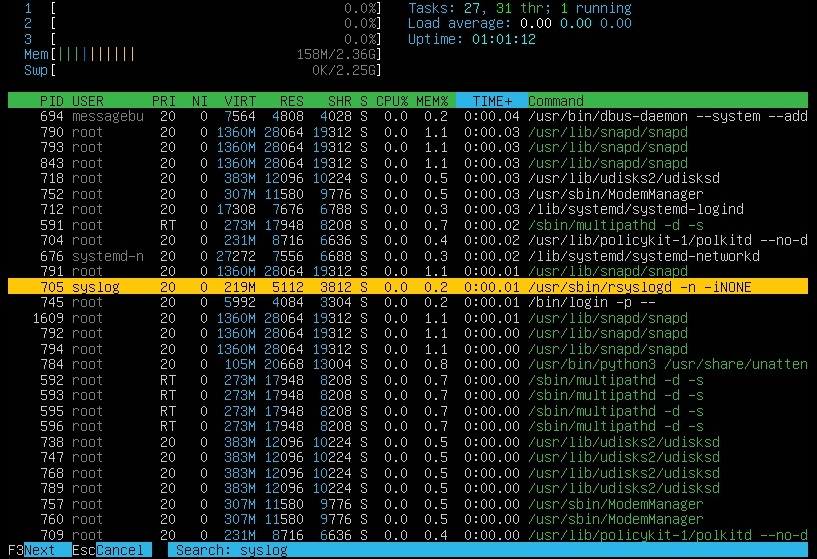

***Вывод команды htop с добавленным выводом hostname, clock и uptime:***  

  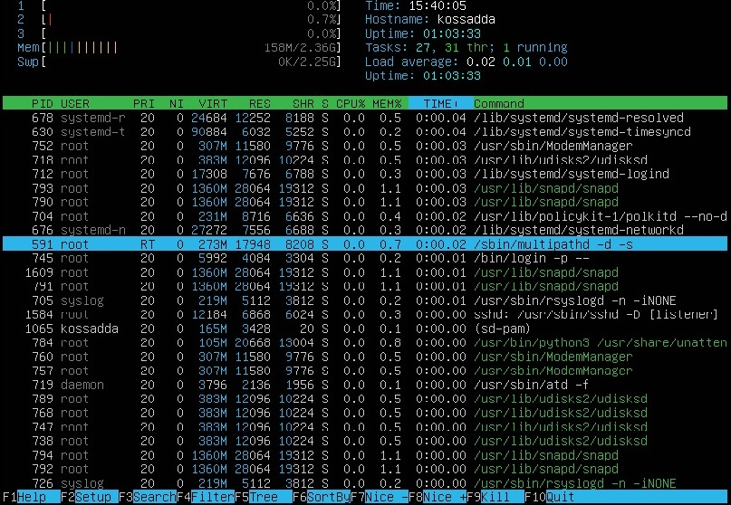

 

# Part 10. Установка и использование утилит top, htop   
